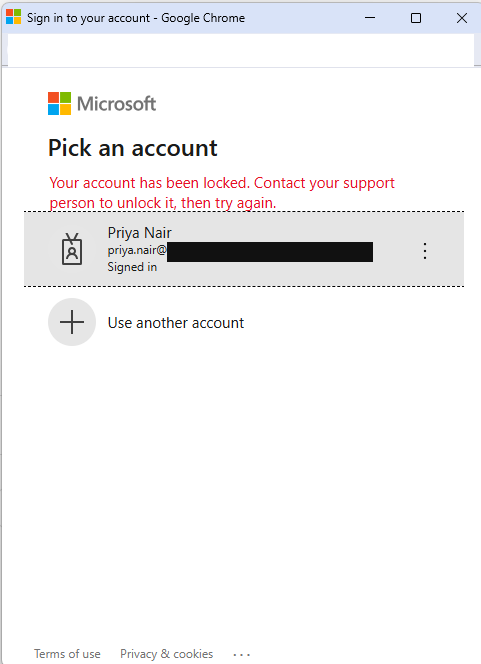
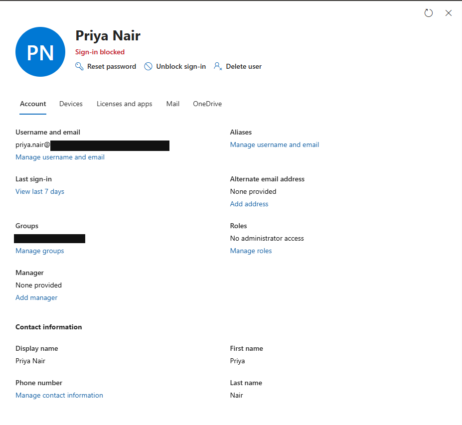
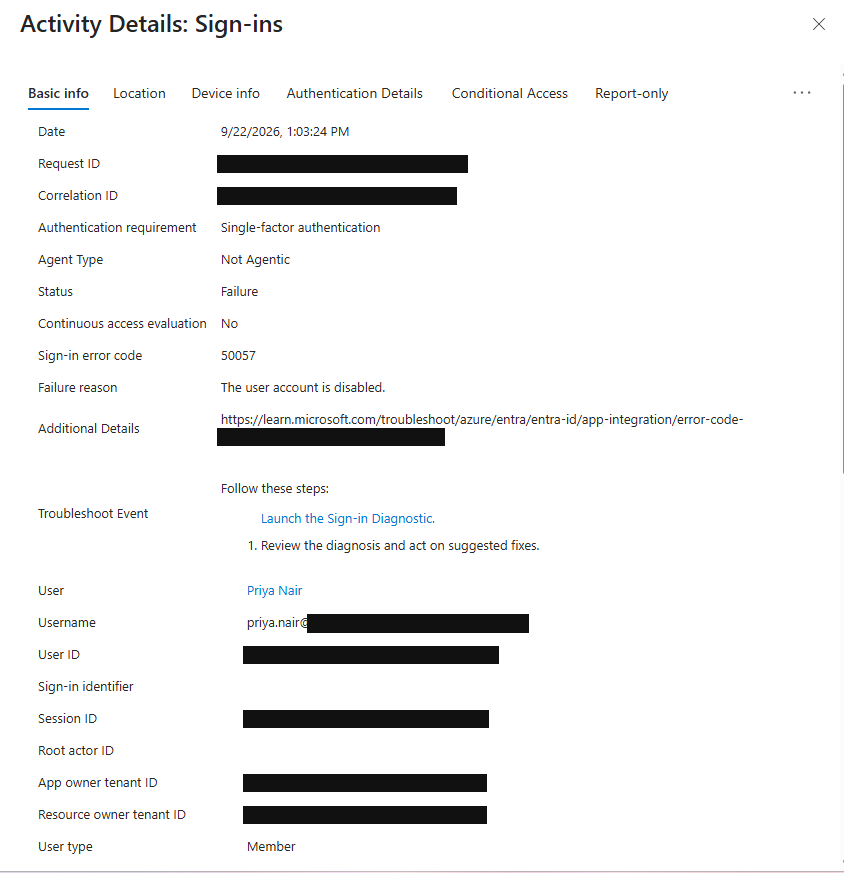
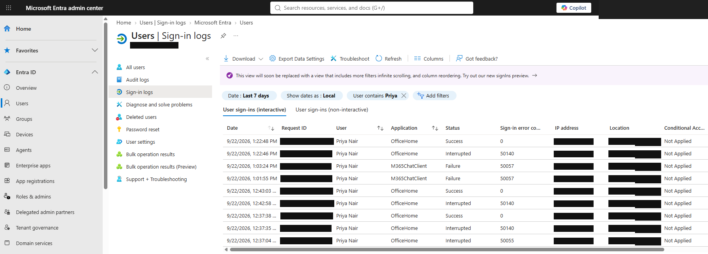
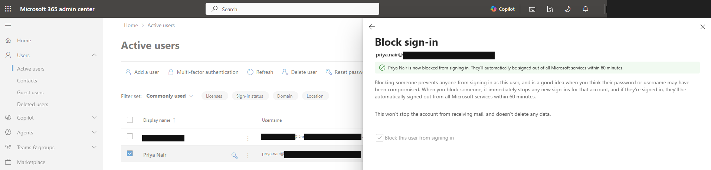
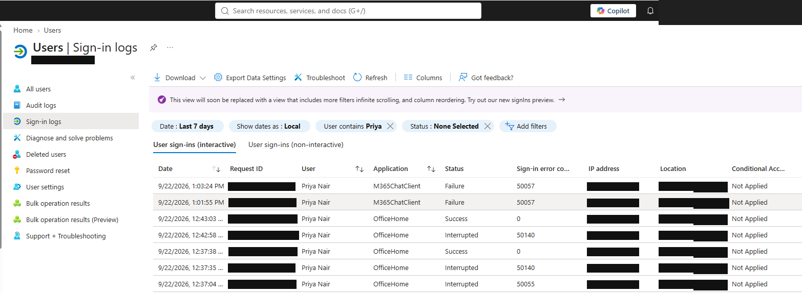

# HSP-1001 — Microsoft 365 Sign-In Failure

> **Lab case**  
> Fictional Harbour Street Partners environment. Synthetic users. Staged personal-lab incident, not a customer incident or production employment.

## 30-Second Summary

**Problem.** Priya Nair's staged report was that Microsoft 365 sign-in failed; she suspected the password.

**Finding.** The account showed **Sign-in blocked**. The relevant Microsoft Entra failure detail recorded `50057`: “The user account is disabled.”

**Action.** The sign-in block was removed. The password was not reset as the incident resolution.

**Result.** A later Priya **OfficeHome** sign-in row shows **Success** and error `0`.

**Evidence.** The symptom, account state, failure detail and later log row are shown below.

## Primary Evidence

### User-visible symptom

The sign-in window says the account has been locked. That wording alone does not identify the Entra failure reason.

### Account state found

Priya's account panel shows **Sign-in blocked**. The visible **Unblock sign-in** control is a possible action, not proof of a click.

### Diagnostic record

The failed event records `50057` and “The user account is disabled.” This changed the diagnosis from a suspected password issue to account access state.

### Verification in the later log

The **top OfficeHome row at 1:22:48 PM on 22 September 2026** shows **Success / 0**. Earlier rows in the same image include failures and interruptions; they are not the verification event.

Additional staging and investigation evidence

### Staged block

This is the staged fault, not the repair.

### Wider sign-in timeline

The broader view mixes events. The failure detail above is decisive for diagnosis; the later OfficeHome row above is the clearest post-change verification.

## User

Priya Nair — synthetic Finance user.

## Category

Incident — identity and Microsoft 365 sign-in.

## User Report

Staged lab report: Priya could not sign in and thought the password might be wrong. No live customer report was received.

## Business Impact

The synthetic user could not access Microsoft 365 through the attempted sign-in. No wider outage is evidenced.

## Priority

**P3, lab triage judgement:** one affected user, with no evidence of a broader service failure.

## Questions Asked

No live interview occurred. The lab scenario supplied the attempted sign-in and suspected password issue; no further answers are recorded.

## Initial Hypothesis

Incorrect password was plausible from the staged report. The analyst checked account state and sign-in information before considering a reset.

## Evidence Collected

The user-visible error, blocked account panel, Entra `50057` failure detail, and subsequent OfficeHome **Success / 0** event. Staging and wider timeline images are in the collapsed section.

## Troubleshooting

The sign-in window showed a lock message. Microsoft 365 administration showed **Sign-in blocked**. The Entra event identified a disabled account rather than a bad-password code.

## Root Cause

A sign-in block staged on Priya's synthetic account.

## Resolution

The lab incident record states that the sign-in block was removed. No screenshot captures the unblock click itself; the later successful sign-in is the outcome evidence. No password reset was used as the resolution.

## Verification

The later, top OfficeHome row in `07-signin-restored-log.png` records **Success** with error `0`. This supports restored sign-in for that event, not a claim about every Microsoft 365 workload.

## User Communication

**Simulated lab communication — not sent to a real user:** “Your account sign-in was blocked. The block has been removed and a later Microsoft 365 sign-in succeeded. Your password was not reset for this incident.”

## Escalation

Not escalated in the lab record; the account-state fault was identified and a successful later sign-in was observed.

## Closure Notes

Staged account block identified through `50057`; access restored and checked against the later OfficeHome success row.

## Related KB / SOP

[Ticket and evidence standard](../docs/ticket-standard.md). No case-specific KB article is claimed.

## Linked Tickets / Assets

[HSP-1002 — MFA Recovery](HSP-1002-mfa-recovery.md) uses the same synthetic user. No asset is linked.
