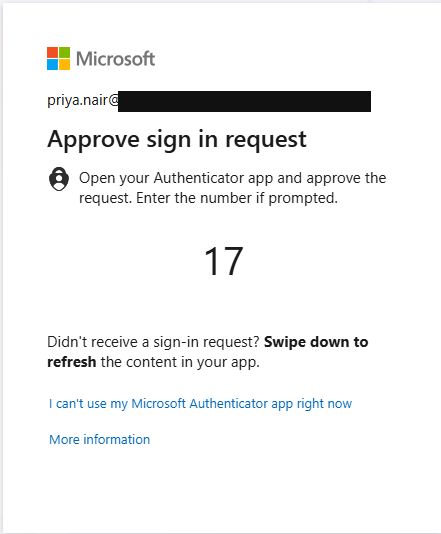
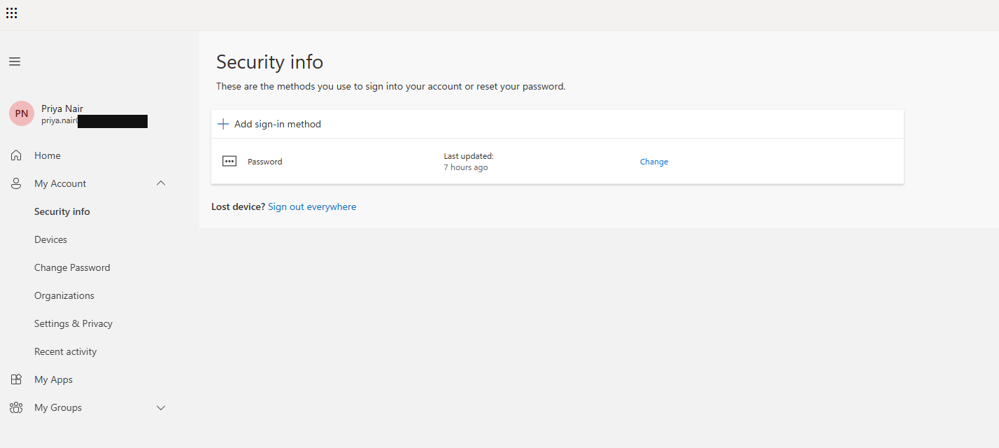
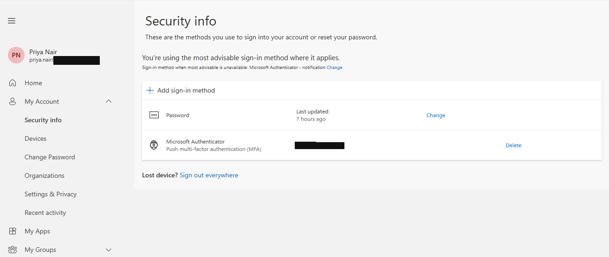
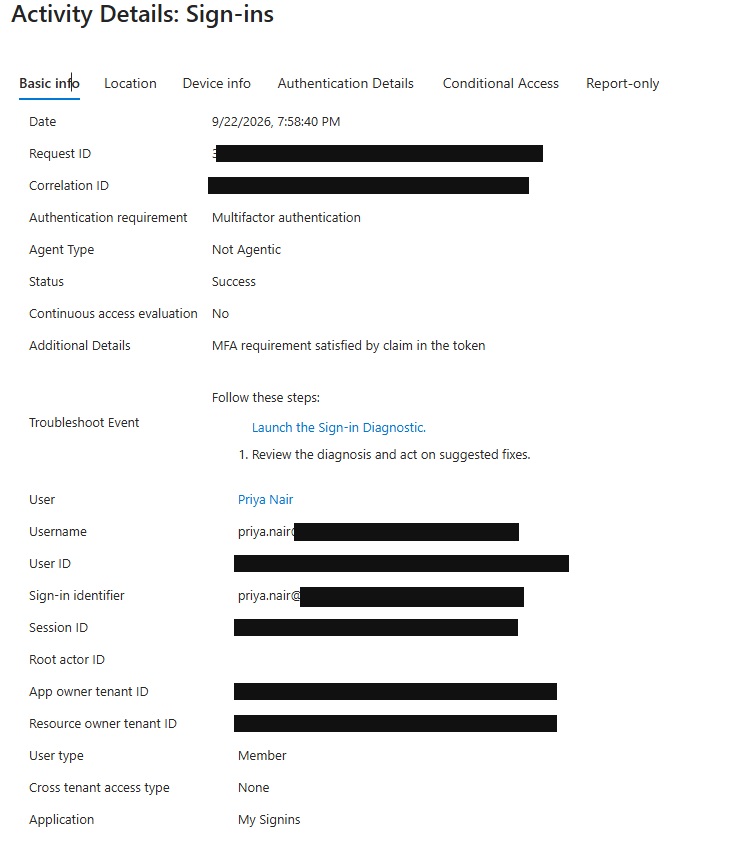
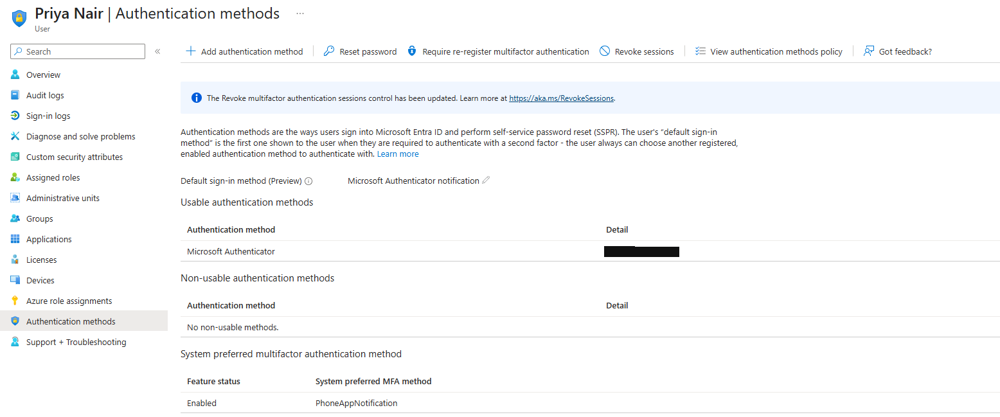
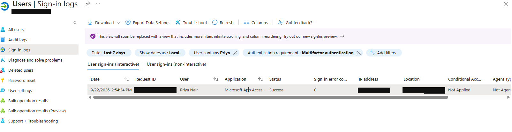

# HSP-1002 — MFA Recovery

> **Lab case**  
> Fictional Harbour Street Partners environment. Synthetic users. Staged personal-lab case, not a customer incident or production employment.

## 30-Second Summary

**Problem.** In the lab scenario, Priya Nair replaced her previous phone and could not use the required Microsoft Authenticator prompt.

**Finding.** Authenticator was an existing method. A written lab note records an account match and fictional manager approval before recovery.

**Action.** The unavailable Authenticator method was removed and Microsoft Authenticator was registered again.

**Result.** Security info shows Authenticator restored. A later Entra sign-in detail shows **Success** with an MFA requirement, but says that requirement was **satisfied by a claim in the token**; the image does not show a fresh app approval.

**Evidence.** Prompt, verification note, method states and sign-in detail below.

## Primary Evidence

### Authentication prompt

The prompt requires Authenticator approval. The reason Priya could not use the old phone comes from the [lab identity-verification note](../evidence/HSP-1002/03-identity-verification-note.txt), not from the screenshot.

### Identity check before recovery

The [source note copied as evidence](../evidence/HSP-1002/03-identity-verification-note.txt) records that Priya was matched to the intended Microsoft 365 account and that fictional office manager Alex Romero approved the recovery before the MFA action. It does not state the verification channel or provide an independent approval screenshot. The reusable [lab identity-verification SOP](../sops/identity-verification.md) preserves that sequence without inventing a corporate policy.

### Method removed

At this point the security-info list shows only **Password**. This is an intermediate recovery state, not the completed fix.

### Authenticator registered again

The later security-info page lists **Microsoft Authenticator — Push multi-factor authentication (MFA)**.

### Subsequent sign-in record

The later sign-in record shows **Success** and **Multifactor authentication** as the requirement. Its detail says **“MFA requirement satisfied by claim in the token”**. It verifies a successful sign-in with the requirement satisfied; it does not establish that Priya approved a new Authenticator prompt during that event.

Before-state and supporting sign-in evidence

### Existing method

Authenticator was listed before the recovery. A banner about the revoke-sessions control is visible, but this image is not used as proof that sessions were revoked in this case.

### Earlier MFA-required success

This is context for the prior MFA state, not proof of the replacement method's later use.

## User

Priya Nair — synthetic Finance user.

## Category

Incident — authentication method recovery.

## User Report

Staged lab report: the previous phone had been replaced and the required Authenticator prompt could no longer be used.

## Business Impact

The synthetic user's sign-in was interrupted at MFA. No other user impact is evidenced.

## Priority

**P3, lab triage judgement:** one user blocked at authentication, with an identity check required before administrative recovery.

## Questions Asked

No live interview transcript exists. The written record identifies the intended account and replacement-phone scenario; it does not record the check method.

## Initial Hypothesis

The registered Authenticator method was tied to a phone Priya could no longer use.

## Evidence Collected

Before-state Authenticator listing, blocked prompt, [identity-verification note](../evidence/HSP-1002/03-identity-verification-note.txt), intermediate password-only security info, re-registered method and later successful sign-in detail.

## Troubleshooting

The original method was confirmed in Entra. The lab note records identity match and fictional manager approval before recovery. The method list then showed an intermediate password-only state, followed by a new Authenticator entry.

## Root Cause

The staged request states that the previously registered Authenticator method was unavailable after a phone replacement. The screenshots show the prompt and method states; they do not independently show the phone replacement.

## Resolution

The prior Authenticator method was removed, then Microsoft Authenticator was registered again. The identity check was documented before the method change.

## Verification

The new Authenticator entry is visible in security info. The later Entra record is **Success**, with MFA satisfied by a token claim. A fresh, separately captured Authenticator approval is not part of the evidence.

## User Communication

**Simulated lab communication — not sent to a real user:** “After the recorded identity check, the unavailable Authenticator registration was replaced. The account shows the new method and a subsequent successful sign-in. Please report any further prompt issue.”

## Escalation

Not escalated in the lab record. Fictional manager approval is recorded as an identity-check step, not a technical escalation.

## Closure Notes

Identity check recorded before method change; Authenticator re-registered; later sign-in succeeded within the verification scope above.

## Related KB / SOP

[Lab identity-verification SOP](../sops/identity-verification.md).

## Linked Tickets / Assets

[HSP-1001 — Sign-In Failure](HSP-1001-signin-failure.md) involves the same synthetic user. No asset is linked.
