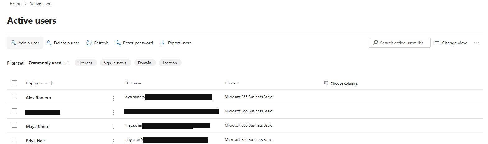
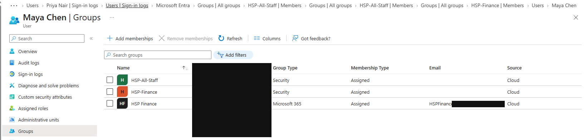
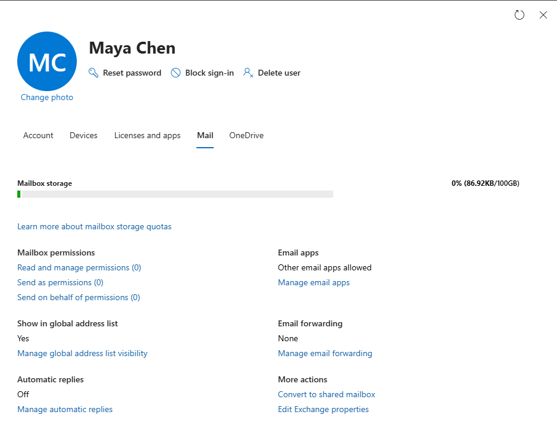
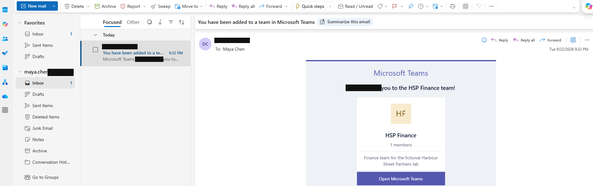
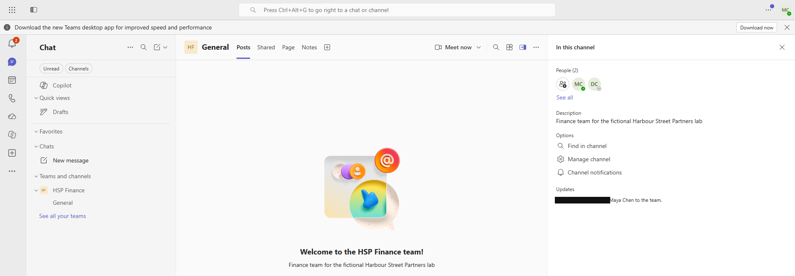
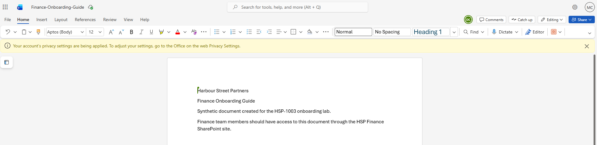
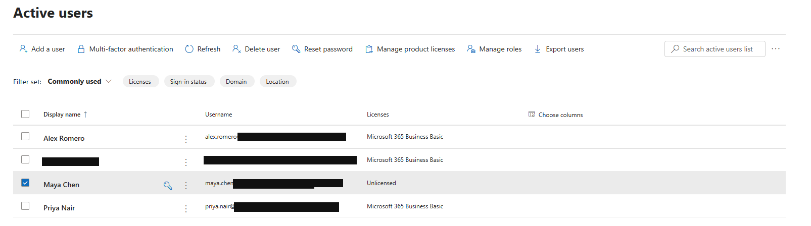

# HSP-1003 — New Starter Onboarding

> **Lab case**  
> Fictional Harbour Street Partners environment. Synthetic users. Staged personal-lab service request, not a customer request or production employment.

## 30-Second Summary

**Request.** Provision Microsoft 365 access for Maya Chen, a synthetic Finance starter.

**Finding.** Maya existed in the tenant and was initially unlicensed. The [lab checklist](../evidence/HSP-1003/07-onboarding-checklist.txt) set out the requested services and checks.

**Action.** Business Basic was assigned; Maya appeared in HSP-All-Staff, HSP-Finance and the HSP Finance Microsoft 365 group. The admin centre showed a mailbox.

**Result.** Maya's Outlook inbox opened a Teams invitation, her Teams session displayed the HSP Finance channel, and her account opened a synthetic Finance onboarding document in Word on the web.

**Evidence.** Provisioning state and user-context checks below, with the baseline in a collapsed section.

## Request and Provisioning

The [onboarding checklist](../evidence/HSP-1003/07-onboarding-checklist.txt) records user creation, licence assignment, group and Team membership, mailbox provisioning, and service checks as completed lab tasks. The screenshots below independently show the visible post-change states.

### Business Basic licence

Maya's row shows **Microsoft 365 Business Basic**.

### Group and Team membership

The list shows the two security groups and the **HSP Finance** Microsoft 365 group. It is a membership state, not a record of each add action.

### Mailbox present

The admin Mail tab shows mailbox storage and settings. User-context Outlook access is checked separately below.

## User-Context Verification

### Outlook

Maya's Outlook session opens a Teams invitation addressed to her. This verifies mailbox access and receipt of that message; no send-and-receive test is claimed.

### Teams

The Teams session shows the **HSP Finance** team and **General** channel with Maya's initials in the account indicator.

### Finance document

A synthetic **Finance-Onboarding-Guide** is open in Maya's web session. This supports access to that document, which the checklist records as a Finance SharePoint check; the image does not establish every permission on the site.

Pre-licensing baseline

Maya's initial row shows **Unlicensed**.

## User

Maya Chen — synthetic Finance starter.

## Category

Service request — Microsoft 365 new starter onboarding.

## User Report

The lab request was to provide Finance access to Microsoft 365 services. No real user request or live interview occurred.

## Business Impact

The synthetic starter needed a licence, groups, mail and collaboration access before using the lab services.

## Priority

**P3, lab triage judgement:** scheduled single-user onboarding, with no outage or production start date recorded.

## Questions Asked

No live discussion is documented. The checklist identifies Maya, Finance and the access to provision; no additional requirements are assumed.

## Initial Hypothesis

Not a fault investigation. The baseline check showed an existing but unlicensed account.

## Evidence Collected

Before/after licence rows, group membership, admin mailbox panel, Maya-context Outlook and Teams views, the opened Finance document, and the [completed lab checklist](../evidence/HSP-1003/07-onboarding-checklist.txt).

## Troubleshooting

The request was validated against the baseline, then each required service was checked in the admin view and, where available, Maya's session. No failed provisioning step is evidenced.

## Root Cause

Not applicable: this was a planned service request. The initial unlicensed state was a provisioning prerequisite, not an incident cause.

## Resolution

The checklist records user creation and completion of the requested setup. The screenshots show a Business Basic licence, the listed memberships, mailbox presence and service access after provisioning.

## Verification

Maya opened Outlook and the Teams invitation, the HSP Finance General channel appeared in her Teams session, and the synthetic Finance document opened in her web session. These are specific access checks, not a claim of all possible mailbox, Teams or SharePoint permissions.

## User Communication

**Simulated lab communication — not sent to a real user:** “Your Microsoft 365 account has the Finance access listed in the onboarding request. Outlook, the HSP Finance team and the onboarding document were checked in your lab session.”

## Escalation

Not escalated in the lab record; the requested checks were completed.

## Closure Notes

Finance onboarding checklist completed; licence and memberships visible; Outlook, Teams and document access checked as Maya.

## Related KB / SOP

[Ticket and evidence standard](../docs/ticket-standard.md). The [onboarding checklist](../evidence/HSP-1003/07-onboarding-checklist.txt) is case evidence, not a corporate SOP.

## Linked Tickets / Assets

No completed device ticket or asset record is linked in this repository.
