# HSP-1004 — User Offboarding

> **Lab case**  
> Fictional Harbour Street Partners environment. Synthetic users. Staged personal-lab service request, not a customer request or production employment.

## 30-Second Summary

**Request.** Restrict Owen Blake's Microsoft 365 access and retain a path to his synthetic mailbox and a OneDrive handover document.

**Finding.** Owen had a Microsoft 365 account, Business Basic licence, group memberships, mailbox and a OneDrive handover file in the lab baseline.

**Action.** Sign-in was blocked; the mailbox was converted to shared and a member was listed; a copy of the handover document appeared in an administrator's OneDrive; HSP-All-Staff and HSP-Operations memberships and Owen's licence were removed.

**Result.** A later sign-in attempt showed a lock message. The shared mailbox still opened in Outlook after licence removal. One unrelated Microsoft 365 group membership remained visible. No endpoint action or access handover to Alex Romero is established by the evidence.

**Evidence.** The stages below show containment, mailbox and data handling, cleanup and post-change checks.

## Access Containment

### Sign-in blocked

[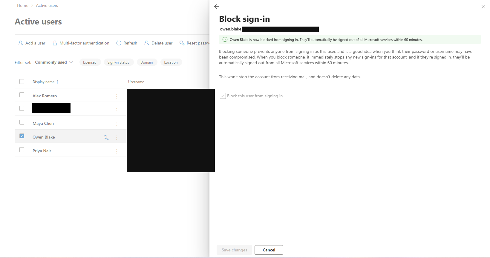](../evidence/HSP-1004/03-owen-signin-blocked.png)

The admin confirmation states that Owen is blocked from new sign-ins. The interface notes that existing sessions may take up to 60 minutes to sign out; no separate session-revocation action is evidenced.

### User-facing denial

[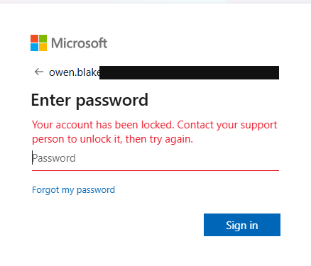](../evidence/HSP-1004/04-owen-signin-denied.png)

A later Owen sign-in window displays the lock message. It demonstrates denial at this attempt, not a full review of all active sessions.

## Mailbox and Data Handover

### Shared-mailbox conversion

[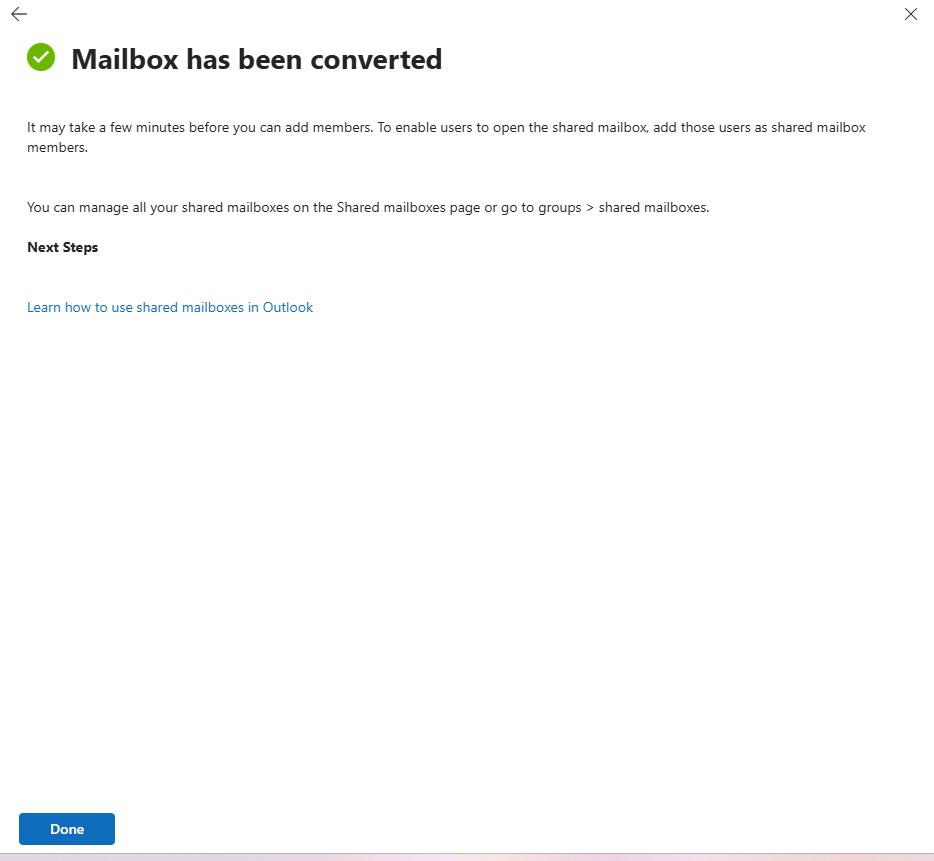](../evidence/HSP-1004/06-owen-mailbox-converted-shared.png)

The conversion confirmation is generic; the Owen mailbox panel below ties the later shared-mailbox state to his account.

### Shared-mailbox member and permissions

[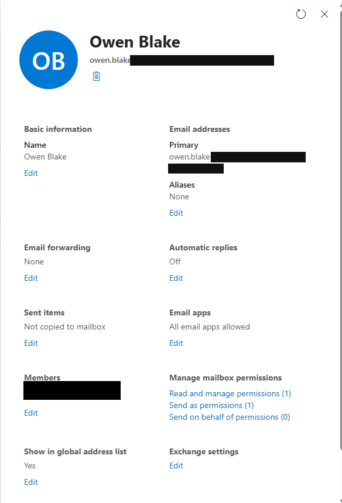](../evidence/HSP-1004/07-owen-shared-mailbox-handover.png)

Owen's shared-mailbox panel lists **one member**, **Read and manage permissions (1)** and **Send as permissions (1)**. The member's real administrator name is redacted in the repository copy. The screenshot does **not** show Alex Romero as the recipient or prove that Alex accessed the mailbox.

### OneDrive handover file

[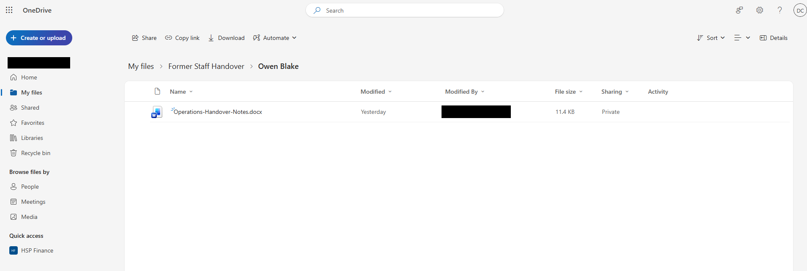](../evidence/HSP-1004/11-owen-onedrive-handover.png)

The synthetic **Operations-Handover-Notes.docx** appears under **My files → Former Staff Handover → Owen Blake** in the administrator's OneDrive. This supports a lab-administrator handover copy, not manager access, a complete OneDrive transfer or removal of Owen's original data.

Additional OneDrive administration evidence

[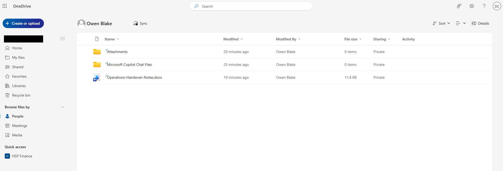](../evidence/HSP-1004/05-owen-onedrive-admin-access.png)

The administrator could view Owen's OneDrive file before the handover-folder screenshot. The administrator name is redacted in the repository copy.

## Access Cleanup

### Group state after removal

[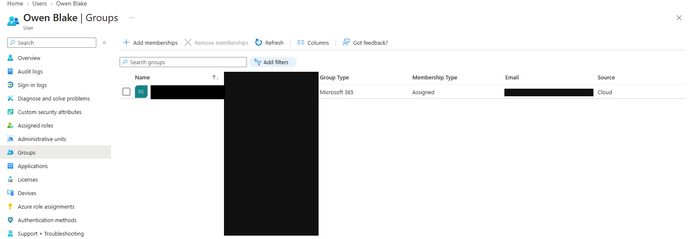](../evidence/HSP-1004/08-owen-groups-removed.png)

The earlier **HSP-All-Staff** and **HSP-Operations** memberships no longer appear. A separate Microsoft 365 group still appears in the screenshot, so this is **not** evidence that all group access was removed. Its real-person name is redacted in the repository copy.

### Licence removed

[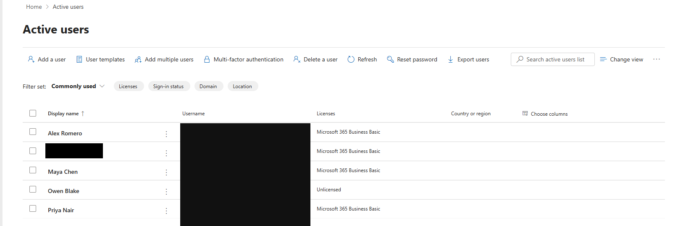](../evidence/HSP-1004/09-owen-licence-removed.png)

Owen's row shows **Unlicensed**. The real administrator's name elsewhere in the list is redacted in the repository copy.

## Post-Offboarding Verification

### Shared mailbox after licence removal

[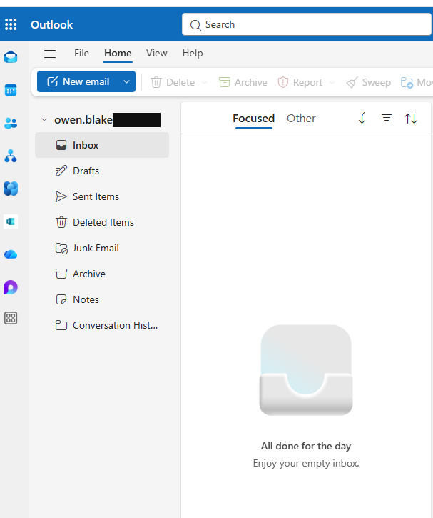](../evidence/HSP-1004/10-owen-shared-mailbox-post-licence.png)

The Outlook view shows Owen's mailbox opening in the lab after the unlicensed account screenshot. Together these support mailbox availability in that session; they do not prove long-term retention, delivery or every delegated permission.

### Endpoint scope

The [device offboarding note](../evidence/HSP-1004/12-device-offboarding-note.txt) states that no managed endpoint was enrolled or assigned to Owen in this Business Basic lab. It explicitly records **no Intune retire action, remote wipe or device ownership transfer**.

Pre-offboarding baseline evidence

### Owen's OneDrive file

[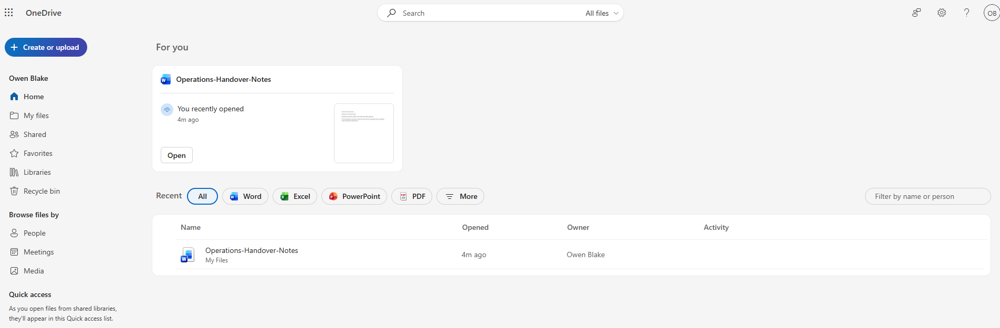](../evidence/HSP-1004/01-owen-onedrive-baseline.png)

The file was visible in Owen's OneDrive before the handover-folder check.

### Group membership before cleanup

[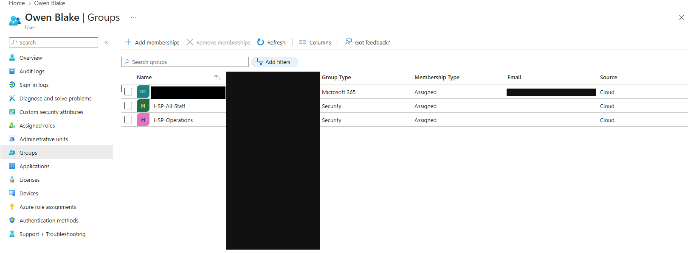](../evidence/HSP-1004/02-owen-group-membership-before.png)

The two HSP security groups and one additional Microsoft 365 group were present before cleanup. The additional group's real-person name is redacted in the repository copy.

## User

Owen Blake — synthetic Operations leaver.

## Category

Service request — Microsoft 365 offboarding.

## User Report

Staged lab request: stop Owen's Microsoft 365 sign-in and preserve relevant mailbox and OneDrive information for handover. No real leaver request was received.

## Business Impact

The lab request concerns account access and continuity of synthetic mailbox and document information. No production data or device fleet is involved.

## Priority

**P2, lab triage judgement:** leaver access containment has a time-sensitive security purpose, although no actual departure time or production SLA is recorded.

## Questions Asked

No live requester interview is documented. The screenshots do not identify an authorised manager recipient for mailbox or OneDrive access.

## Initial Hypothesis

Not a fault investigation. The work was ordered around access containment, retaining needed information, removing group and licence access, then verifying the visible post-change state.

## Evidence Collected

Blocked-sign-in confirmation and denied attempt; shared-mailbox conversion and member panel; administrator views of Owen's OneDrive file and handover folder; before/after group state; unlicensed row; Outlook mailbox view; and the [device scope note](../evidence/HSP-1004/12-device-offboarding-note.txt).

## Troubleshooting

The account was blocked and a subsequent sign-in attempt was denied. The mailbox was converted to shared, with one member and permissions visible. The OneDrive document was found from the administrator view and appeared in an administrator-owned handover folder. HSP-All-Staff and HSP-Operations no longer appeared after cleanup, though one other group remained. The account then showed **Unlicensed**.

## Root Cause

Not applicable: planned offboarding service request.

## Resolution

Microsoft 365 account sign-in was blocked; Owen's mailbox was converted to shared; a lab-administrator copy of the named OneDrive file was placed in a handover folder; two HSP security-group memberships and the Business Basic licence were removed. The screenshot set does not evidence session revocation, Alex Romero receiving access, deletion of every group membership, address-list hiding or endpoint action.

## Verification

The sign-in window showed denial, the account row showed **Unlicensed**, and Outlook opened Owen's shared mailbox after the licence change. The handover folder displayed the named document. This verification is limited to the captured states and session.

## User Communication

**Simulated lab communication — not sent to a real user:** “Owen's sign-in has been blocked. The mailbox is shared and remains accessible in the lab check; the handover document is in the administrator's OneDrive folder. HSP-All-Staff and HSP-Operations were removed. A separate group membership and recipient-specific handover still require review.”

## Escalation

No actual escalation occurred. In a real request, the remaining group and intended mailbox/OneDrive recipient would need an owner decision before claiming complete offboarding.

## Closure Notes

M365 containment and the listed changes were checked. The remaining group, recipient handover and endpoint limitations are disclosed; this is not a claim of complete real-world leaver processing.

## Related KB / SOP

[Ticket and evidence standard](../docs/ticket-standard.md) · [Licensing and feature limits](../docs/licensing.md).

## Linked Tickets / Assets

No completed device or asset record is linked. The device note states that no managed endpoint was assigned in this lab.
