# HSP-1005 — Multi-User Email Delivery Incident

> **Lab case**
> Fictional Harbour Street Partners environment. Synthetic users. Staged personal-lab incident, not a customer incident or production employment.

## 30-Second Summary

**Problem.** Priya Nair and Maya Chen each had a staged message to Alex Romero rejected.

**Finding.** Exchange message trace showed both incident-test messages as **Failed**. Priya's detailed trace named the Exchange Online rule `LAB-HSP-1005-Finance-Mail-Block`; the rule configuration covered both senders. The visible Service Health advisories did not describe message rejection.

**Action.** The lab mail-flow rule was disabled.

**Result.** New messages from both users appeared in Alex's inbox and a later trace recorded both as **Delivered**. The same trace retained the earlier delivered baselines and failed incident tests.

**Evidence.** Failed rows, Service Health, the diagnostic trace, rule state and post-change trace are below. Click any image for its full-size, redacted copy.

## Multi-User Failure

[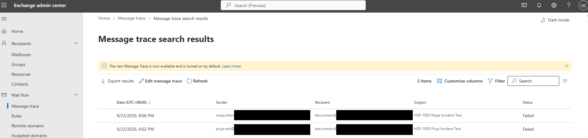](../evidence/HSP-1005/06-message-trace-failures.png)

The trace lists **HSP-1005 Maya Incident Test** and **HSP-1005 Priya Incident Test** as **Failed**. The common recipient and close timing prompted investigation of shared mail flow. Tenant-domain portions of the addresses are redacted in the repository copy.

## Microsoft 365 Service Health

[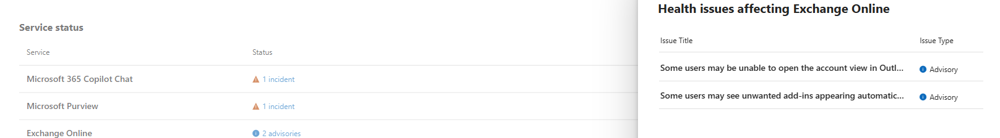](../evidence/HSP-1005/05-exchange-service-health.png)

Exchange Online showed two advisories. Their visible, truncated titles refer to Outlook account-view access and unwanted add-ins; neither visible title describes message rejection. This made a matching service advisory less likely, but the trace below established the actual cause.

## Diagnostic Trace

[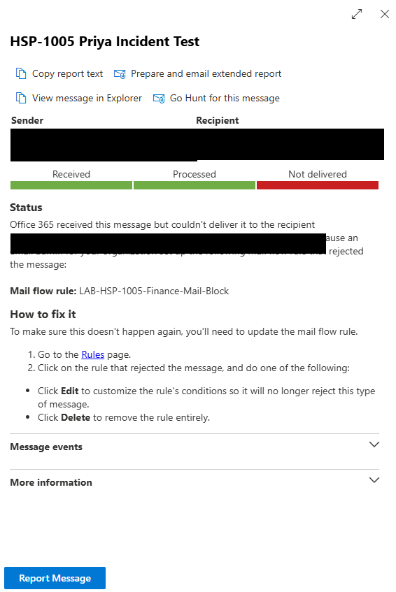](../evidence/HSP-1005/07-message-trace-root-cause.png)

Priya's detailed trace shows **Received → Processed → Not delivered** and names `LAB-HSP-1005-Finance-Mail-Block` as the rejecting rule. The [enabled rule's comment and configuration](../evidence/HSP-1005/02-mail-flow-rule-enabled.png) identify Priya and Maya as its staged sender scope. This is stronger evidence of a shared cause than two failed-status rows alone.

## Remediation

[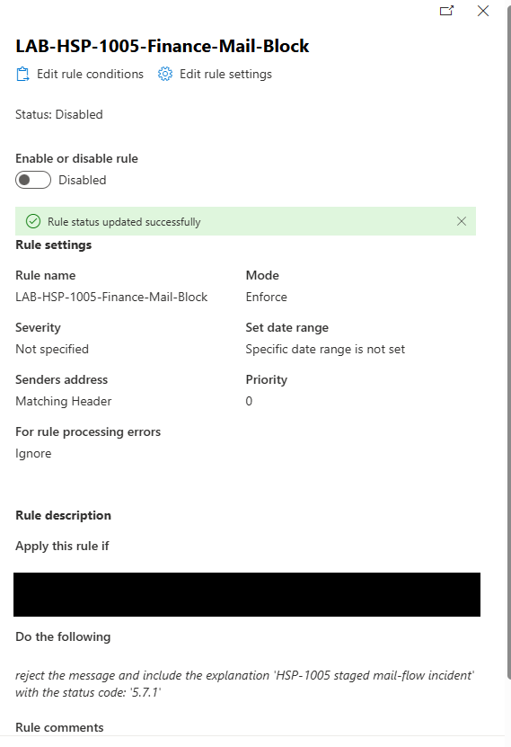](../evidence/HSP-1005/08-mail-flow-rule-disabled.png)

The named rule shows **Status: Disabled** and **Rule status updated successfully**. This is the captured remediation state. The supplied lab narrative says the staged rule was deleted after testing; no deletion screenshot is included.

## Post-Change Verification

[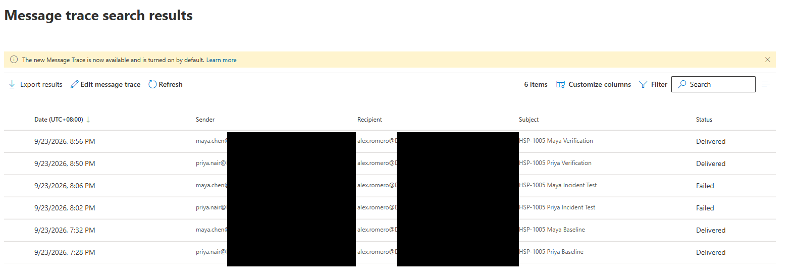](../evidence/HSP-1005/11-message-trace-success.png)

The final trace shows six scoped messages: Priya and Maya baseline **Delivered**, both incident tests **Failed**, then Priya and Maya verification **Delivered**. The verification rows are the top two, at **8:50 PM** and **8:56 PM** on 23 September 2026. [Alex's inbox view](../evidence/HSP-1005/10-maya-mail-restored.png) also shows both verification subjects.

Additional staging and user-level evidence

### Baseline delivery

[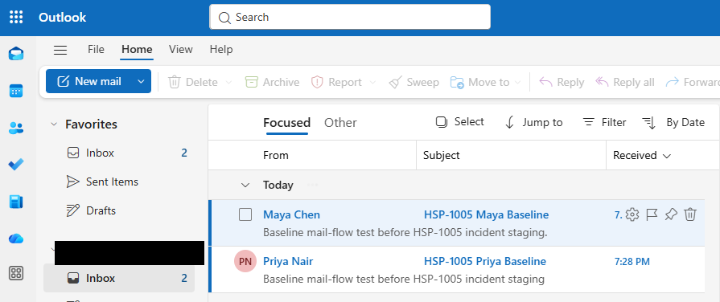](../evidence/HSP-1005/00-baseline-mail-delivery.png)

Both synthetic baseline subjects appeared in Alex's inbox before the incident test.

### Staged rule conditions

[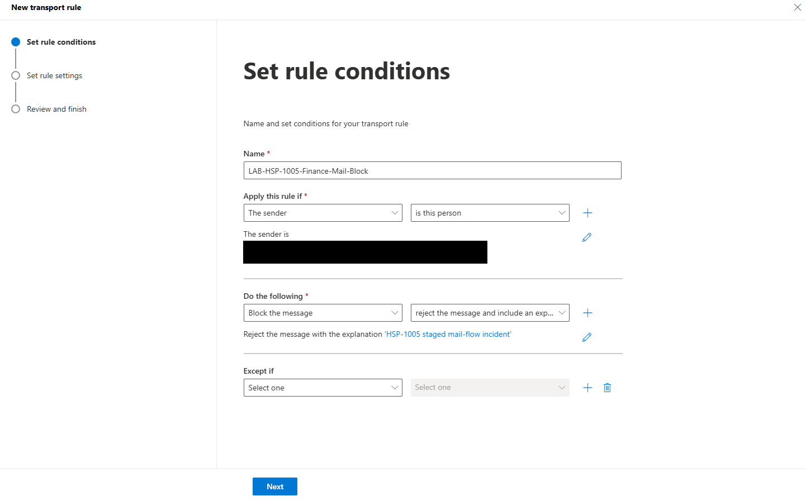](../evidence/HSP-1005/01-staged-mail-flow-rule.png)

The rule form shows the staged reject action. Sender addresses are redacted; the enabled rule below records the later active state.

### Rule enabled

[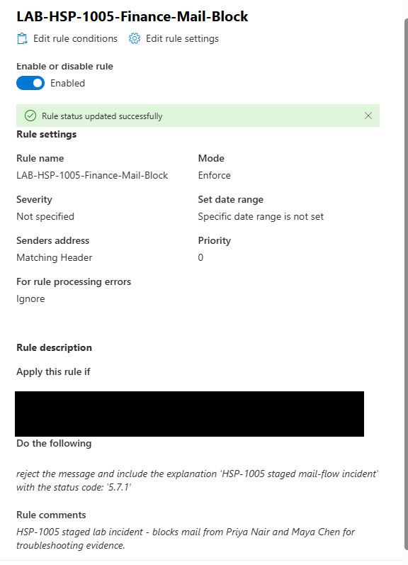](../evidence/HSP-1005/02-mail-flow-rule-enabled.png)

The rule was **Enabled** in **Enforce** mode. Its visible lab comment says it blocks mail from Priya and Maya for troubleshooting evidence.

### Priya's rejection notice

[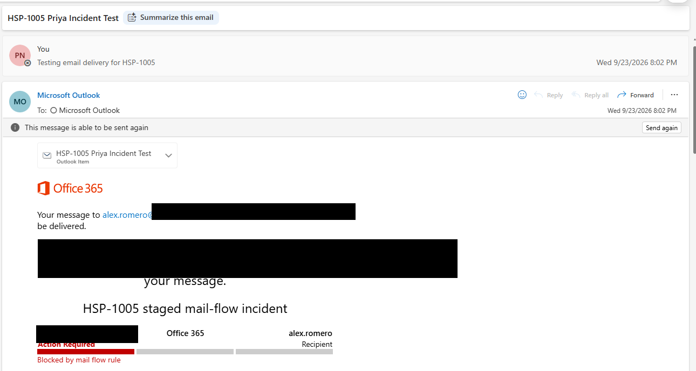](../evidence/HSP-1005/03-priya-mail-failure.png)

Priya's incident-test message shows a non-delivery view and **Blocked by mail flow rule**.

### Maya's rejection notice

[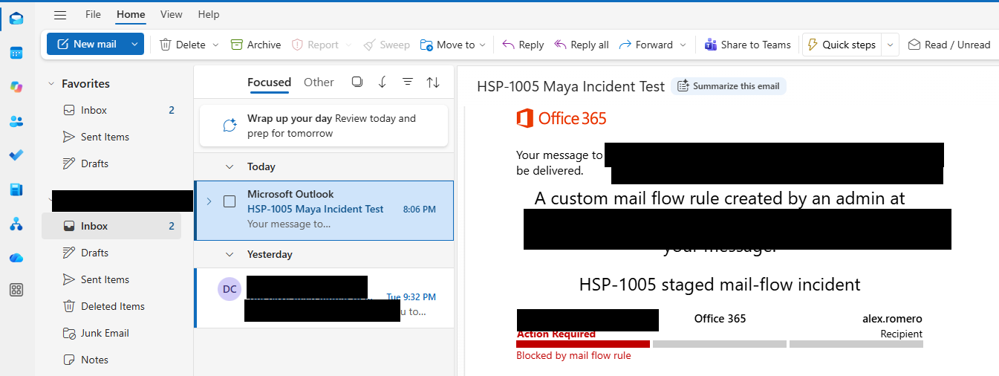](../evidence/HSP-1005/04-maya-mail-failure.png)

Maya's incident-test message shows the same type of rejection. Unrelated real-person and tenant-domain details are redacted.

### Priya's delivered verification message

[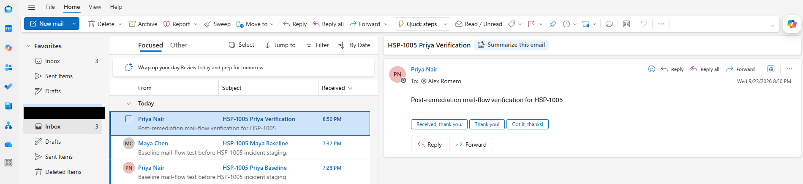](../evidence/HSP-1005/09-priya-mail-restored.png)

Alex's inbox shows Priya's new verification message.

### Both delivered verification messages

[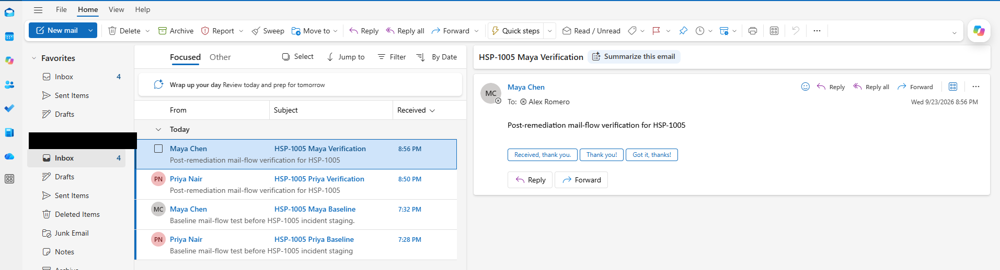](../evidence/HSP-1005/10-maya-mail-restored.png)

Maya's verification message and Priya's earlier one are both visible in Alex's inbox.

## User

Priya Nair and Maya Chen — synthetic affected senders. Alex Romero — synthetic verification recipient.

## Category

Incident — Exchange Online message delivery.

## User Report

Staged lab scenario: Priya and Maya could not deliver incident-test messages to Alex. No real customer reports were received.

## Business Impact

The captured failure affected two synthetic senders sending to one recipient. The evidence does not establish an organisation-wide outage or failure to all recipients.

## Priority

**P3, lab triage judgement:** more than one user was affected, without evidence of complete email-service loss.

## Questions Asked

No live interview occurred. Investigative questions were whether the sender and recipient scope matched, whether Service Health listed a relevant incident, where Exchange rejected the messages, and whether one mail-flow rule covered both senders.

## Initial Hypothesis

A common service issue or mail-flow setting was more plausible than two simultaneous password faults. Service Health was checked before changing accounts; message trace then located the rejection.

## Evidence Collected

Baseline inbox messages, rule conditions and enabled state, both non-delivery notices, Service Health, failed-message rows, Priya's detailed trace, disabled rule state, Alex's post-change inbox and final message trace.

## Troubleshooting

Baseline mail reached Alex. A staged reject rule was enabled for Priya and Maya; both incident-test messages then failed. Service Health displayed advisories with different visible symptoms. Message trace correlated the failed subjects, and Priya's detail named the rule. The rule was disabled before new messages were sent and traced.

## Root Cause

The staged Exchange Online mail-flow rule `LAB-HSP-1005-Finance-Mail-Block` rejected messages from the two scoped synthetic senders. Priya's trace names it; the enabled rule's lab comment identifies both users, and each non-delivery notice reports a mail-flow block.

## Resolution

The offending rule was disabled. The supplied lab narrative additionally records that it was deleted after verification, but the screenshot set proves only the disabled state and subsequent successful delivery.

## Verification

New messages from Priya and Maya appeared in Alex's inbox. The later Exchange trace recorded both verification messages **Delivered**, while preserving the two earlier **Failed** rows and the delivered baselines.

## User Communication

**Simulated lab communication — not sent to real users:** “The delivery failures were traced to a staged Exchange Online mail-flow rule affecting both accounts. The rule was disabled, and new messages from each account reached the lab recipient. No password reset was required.”

## Escalation

Not escalated in the lab. A production rule change would require the appropriate change owner and approval to be confirmed.

## Closure Notes

Two-user staged rejection traced to one rule; rule disabled; both new messages received and marked **Delivered**. Rule deletion is recorded in the supplied narrative without separate screenshot evidence.

## Related KB / SOP

[Ticket and evidence standard](../docs/ticket-standard.md). No case-specific KB article is claimed.

## Linked Tickets / Assets

No linked asset. [HSP-1001](HSP-1001-signin-failure.md), [HSP-1002](HSP-1002-mfa-recovery.md) and [HSP-1003](HSP-1003-new-starter-onboarding.md) involve the same synthetic users in separate lab cases.
